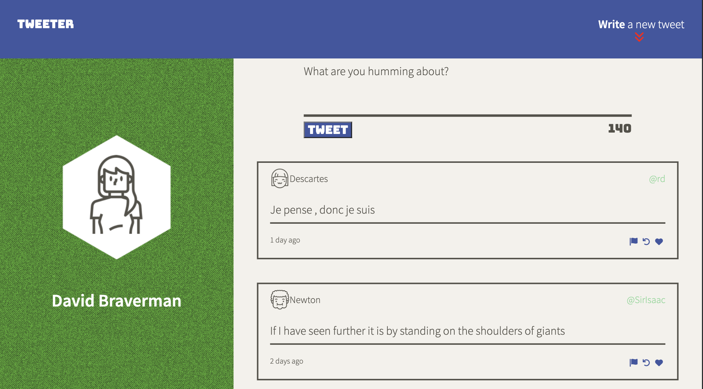
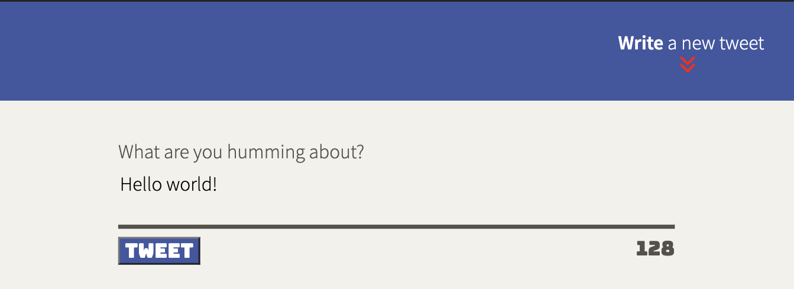
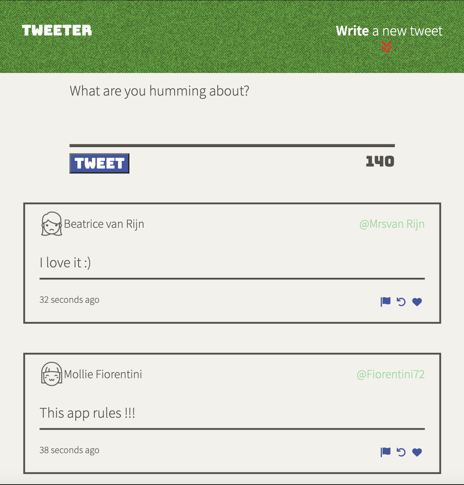
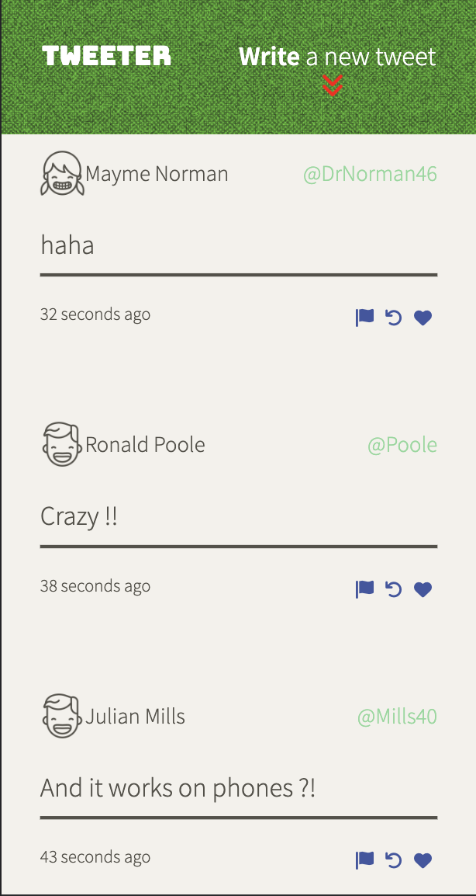

# Tweeter Project

Hello! Welcome and thank you for downloading my Twitter clone, Tweeter!

## About

This is a pure learning experience and educational project, as well as my first foray into creating a website with jQuery and Ajax.

This simple clone takes from an array of premade users, handles, and creates a tweet from the text you typed from the text-input field!

## Additional Features

Comes with full mobile and tablet support!

## Getting Started

1. Install dependencies using the `npm install` command.
2. Start the web server using the `npm run local` command. The app will be served at <http://localhost:8080/>.
3. Go to <http://localhost:8080/> in your browser.

## Dependencies

- Body-parser 1.15.2
- Chance 1.0.2
- Express 4.13.4
- Node 5.10.x or above

### Development Dependencies

- Nodemon 1.9.2
